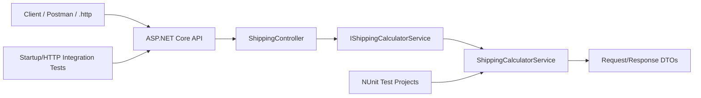
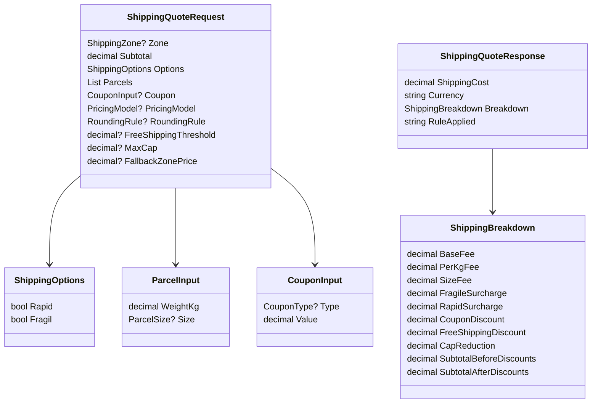
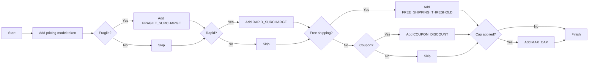
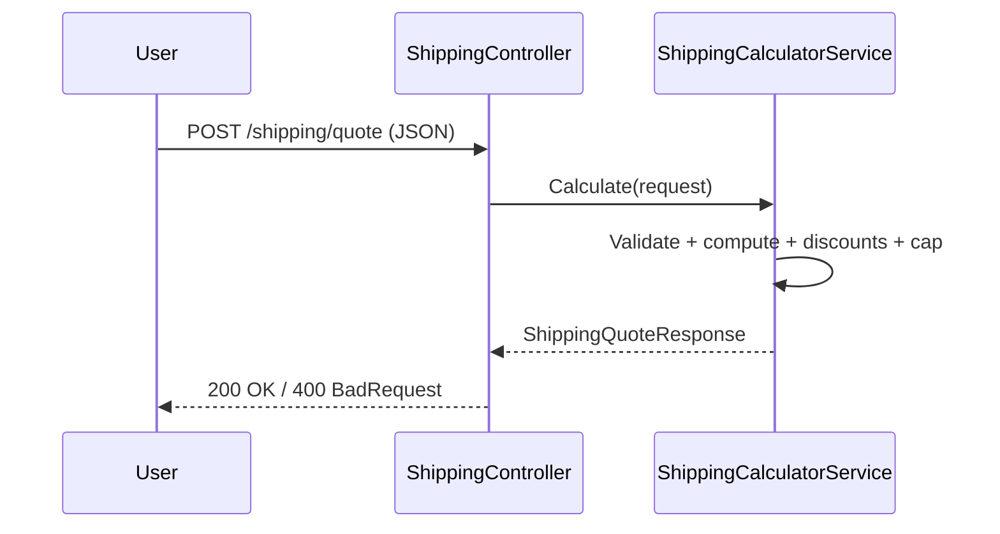
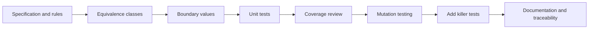
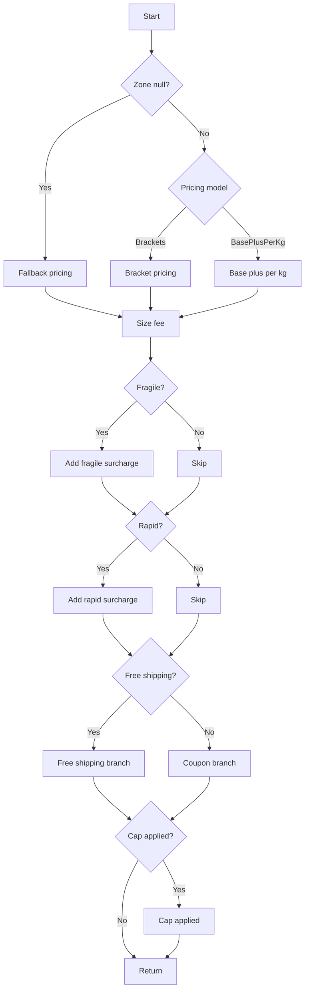

# Project TSS: Shipping Quote API

## Team members
- Dima Florin-Alexandru - Group 462 - FMI Unibuc
- Copilot (GPT-5.3-Codex)

## Demo
[](https://www.youtube.com/watch?v=k5R0SPYNmCI)

## Project scope
This repository contains a .NET 10 shipping quote API and a comprehensive test suite that illustrates the testing strategies required in the course:
- equivalence partitioning
- boundary value analysis
- structural testing (statement, decision, condition)
- independent paths
- mutation testing analysis
- additional tests for killing survived non-equivalent mutants
- randomized and fuzzing-style checks

This README focuses on testing. Detailed mutation analysis and AI testing reports are documented in the separate reports under docs.

---

## Business rules summary
The API calculates shipping costs for a request that contains parcels, zone, pricing model, and optional modifiers.
Key rules enforced by the calculator:
- Input validation for mandatory fields and negative values
- Two pricing models: Brackets and BasePlusPerKg
- Weight rounding rules applied before pricing
- Size-based fees per parcel
- Optional surcharges for fragile and rapid delivery
- Discount handling: free-shipping threshold or coupon discount
- Maximum cap applied after discounts
- Rule traceability via RuleApplied tokens

### Rule tokens produced by the calculator
| Token | Meaning | Trigger |
|---|---|---|
| FALLBACK_ZONE_PRICE | Fallback pricing applied | Zone is null and fallback price is present |
| BRACKETS | Bracket pricing used | PricingModel = Brackets |
| BASE_PLUS_PER_KG | Base plus per kg pricing used | PricingModel = BasePlusPerKg |
| FRAGILE_SURCHARGE | Fragile surcharge applied | Options.Fragil = true |
| RAPID_SURCHARGE | Rapid surcharge applied | Options.Rapid = true |
| FREE_SHIPPING_THRESHOLD | Free shipping applied | Subtotal > FreeShippingThreshold |
| COUPON_DISCOUNT | Coupon applied | Coupon is present and free shipping not applied |
| MAX_CAP | Cap applied | MaxCap is set and net > MaxCap |

---

## Architecture diagrams (Mermaid)

### 1) Component diagram


### 2) Core request and response DTOs


### 3) Shipping calculation decision flow


### 4) Rule trace assembly


### 5) Endpoint sequence


---

## Testing strategy overview

### 1) Strategy map
| Technique | Objective | Target | Evidence (tests) |
|---|---|---|---|
| Equivalence partitioning | Cover representative input classes | Pricing models, zones, request validation | Strategy_BlackBoxTests |
| Boundary value analysis | Guard boundary transitions | Weight brackets, free shipping, cap | Strategy_BlackBoxTests |
| Statement coverage | Execute all statements | ShippingCalculatorService.Calculate | ShippingCalculatorServiceTests |
| Decision coverage | Exercise both branches | Pricing model, rounding, discounts | ShippingCalculatorServiceTests |
| Condition coverage | Toggle atomic conditions | Validation checks | Strategy_WhiteBoxPathTests |
| Independent paths | Cover key end-to-end paths | Fallback, base model, composite modifiers | Strategy_WhiteBoxPathTests |
| Integration tests | Validate API pipeline | Controller and middleware | ShippingControllerTests, ProgramStartupTests |
| Randomized tests | Check invariants under varied data | Valid request generation | Strategy_RandomizedFuzzingTests |
| Mutation testing | Verify assertion strength | ShippingCalculatorService | Stryker report + killer tests |

### 2) Test workflow


---

## Black-box testing details

### Equivalence classes (examples)
| Input | Partitions | Expected behavior |
|---|---|---|
| Zone | Local, National, International | Valid cost computed |
| PricingModel | Brackets, BasePlusPerKg | Correct pricing path executed |
| Coupon | None, Percent, Fixed | Discount applied when valid |

### Boundary values (examples)
| Boundary | Values | Expected behavior |
|---|---|---|
| Bracket thresholds | 1.0, 1.01, 5.0, 5.01, 10.0, 10.01 | Bracket changes at strict thresholds |
| FreeShippingThreshold | Subtotal == threshold | No free shipping (strict greater-than) |
| MaxCap | Shipping == cap | Cap not applied (strict greater-than) |

---

## White-box testing details

### Structural coverage targets
| Coverage type | Target function | Reason |
|---|---|---|
| Statement | ShippingCalculatorService.Calculate | Main orchestration logic |
| Decision | Validation and pricing branches | Correct routing per input |
| Condition | Validation checks | Correct error behavior |

### Independent paths in Calculate


---

## Randomized and fuzzing-style testing
Randomized tests generate valid requests with deterministic seeds and verify invariants:
- ShippingCost is non-negative
- Currency remains RON
- SubtotalAfterDiscounts equals ShippingCost

---

## Mutation testing
Mutation testing is documented in docs/MutationAnalysis.md. The report explains:
- how Stryker mutates the code
- how to interpret survived vs killed mutants
- which two non-equivalent survivors were killed by dedicated tests

---

## AI-assisted testing
AI-assisted testing is documented in docs/AI_Testing_Report.md. The report includes:
- prompts used to generate tests
- analysis of AI output quality
- differences between the AI proposals and the final suite

---

## Environment and configuration
### Hardware and software
- OS: Windows 11 (local machine, no VM)
- .NET SDK: 10.0
- C# language level: 14
- NUnit: 4.3.2
- Microsoft.NET.Test.Sdk: 17.14.0
- coverlet.collector: 6.0.4
- Microsoft.AspNetCore.Mvc.Testing: 10.0.4
- Mutation tool: Stryker.NET (global tool)

---

## Commands
```bash
# Run API
dotnet run --project ProiectTSS/ProiectTSS.csproj

# Run tests
dotnet test ProiectTSS.UnitTests/ProiectTSS.UnitTests.csproj

# Coverage
dotnet test ProiectTSS.UnitTests/ProiectTSS.UnitTests.csproj --collect:"XPlat Code Coverage" --settings coverage.runsettings --results-directory TestResults
reportgenerator "-reports:TestResults/**/coverage.cobertura.xml" "-targetdir:TestResults/CoverageReport" "-reporttypes:Html;TextSummary"

# Mutation testing
cd ProiectTSS.UnitTests
dotnet stryker
```

---

## Tool comparison
| Tool | Purpose | Strengths | Limitations |
|---|---|---|---|
| NUnit | Unit and integration tests | Mature, clear assertions, AAA style | No built-in mutation engine |
| coverlet | Coverage | Native .NET workflow integration | Coverage percent alone does not prove quality |
| Stryker.NET | Mutation testing | Finds weak assertions | Slower than normal unit tests |
| .http and Postman | API checks | Fast manual validation | Not a substitute for automated assertions |

---

## References
[1] C# language documentation, https://learn.microsoft.com/en-us/dotnet/csharp/, Last accessed: 2026-04-04.  
[2] Unit testing C# with NUnit and .NET Core, https://learn.microsoft.com/en-us/dotnet/core/testing/unit-testing-csharp-with-nunit, Last accessed: 2026-04-04.  
[3] Use .http files in Visual Studio 2022, https://learn.microsoft.com/en-us/aspnet/core/test/http-files, Last accessed: 2026-04-04.  
[4] NUnit Documentation, https://docs.nunit.org/, Last accessed: 2026-04-04.  
[5] Coverlet, https://github.com/coverlet-coverage/coverlet, Last accessed: 2026-04-04.  
[6] Stryker.NET, https://stryker-mutator.io/docs/stryker-net/introduction/, Last accessed: 2026-04-04.  
[7] ASP.NET Core Testing, https://learn.microsoft.com/aspnet/core/test/integration-tests, Last accessed: 2026-04-04.  
[8] GitHub Copilot, https://copilot.microsoft.com, Generation date: 2026-04-04.  
[9] GitHub Copilot (GPT-5.3-Codex), assistance used in repository updates and documentation drafting, Generation date: 2026-04-04.  