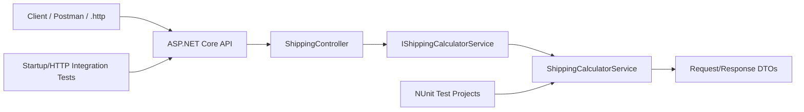
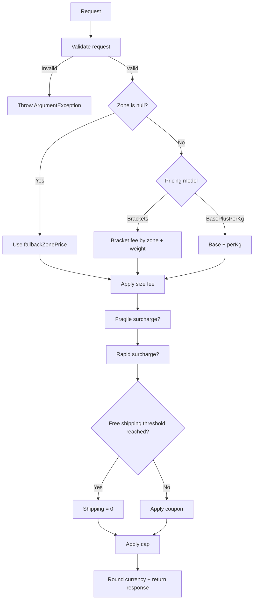
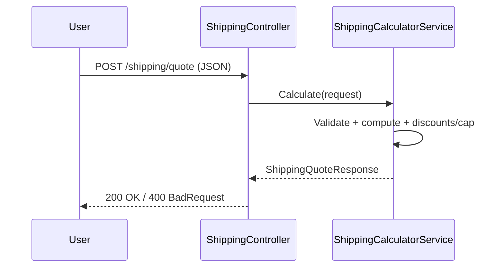

# Project TSS: Shipping Quote API

## Team members:
- Dima Florin-Alexandru - Group 462 - FMI Unibuc
- Copilot (GPT-5.3-Codex)

## Demo
[](https://www.youtube.com/watch?v=k5R0SPYNmCI)

## Project Scope
This repository contains a .NET 10 shipping quote API and a comprehensive test suite that illustrates the testing strategies required in the course:
- equivalence partitioning,
- boundary value analysis,
- structural testing (statement/decision/condition),
- independent paths,
- mutation testing analysis,
- additional tests for killing survived non-equivalent mutants,
- randomized/fuzzing-style checks.

---

## Architecture Diagrams (Mermaid)

### 1) Component Diagram


### 2) Shipping Calculation Decision Flow


### 3) Endpoint Sequence


---

## Testing Strategies Implemented

### 1) Functional (Black-box)
#### Equivalence Partitioning
Implemented with zone classes (`Local`, `National`, `International`) in `Strategy_BlackBoxTests`.

#### Boundary Value Analysis
Implemented for:
- weight thresholds (`1`, `5`, `10`),
- free-shipping threshold equality,
- max-cap equality.

### 2) Structural (White-box)
#### Statement / Decision / Condition Coverage
Covered through:
- broad branch assertions in `ShippingCalculatorServiceTests`,
- condition-oriented checks in `Strategy_WhiteBoxPathTests`.

#### Independent Paths
Explicit independent paths:
- fallback path,
- `BasePlusPerKg` path,
- composite surcharge/coupon path.

### 3) API & Integration Testing
- `ShippingControllerTests` for controller behavior (`200`, `400`),
- `ProgramStartupTests` for startup/environment endpoint behavior.

### 4) Randomized / Fuzzing-style Testing
- deterministic random valid inputs in `Strategy_RandomizedFuzzingTests`.

### 5) Mutation Testing
- mutation analysis documented in `docs/MutationAnalysis.md`.
- extra tests added to target two survived non-equivalent mutants (rule-token tracking for coupon and max-cap branches).

---

## Environment and Configuration
### Software
- .NET SDK: `10.0`
- C# language level: `14`
- NUnit: `4.3.2`
- `Microsoft.NET.Test.Sdk`: `17.14.0`
- `coverlet.collector`: `6.0.4`
- `Microsoft.AspNetCore.Mvc.Testing`: `10.0.4`
- Mutation tool: `Stryker.NET` (global tool)

---

## Commands
```bash
# Run API
dotnet run --project ProiectTSS/ProiectTSS.csproj

# Run tests
dotnet test ProiectTSS.UnitTests/ProiectTSS.UnitTests.csproj

# Coverage
dotnet test ProiectTSS.UnitTests/ProiectTSS.UnitTests.csproj --collect:"XPlat Code Coverage" --settings coverage.runsettings --results-directory TestResults
reportgenerator "-reports:TestResults/**/coverage.cobertura.xml" "-targetdir:TestResults/CoverageReport" "-reporttypes:Html;TextSummary"

# Mutation testing
cd ProiectTSS.UnitTests
dotnet stryker
```

---

## Tool Comparison
| Tool | Purpose | Strengths | Limitations |
|---|---|---|---|
| NUnit | Unit/integration tests | Mature, clear assertions, AAA style | No built-in mutation engine |
| coverlet | Coverage | Native .NET workflow integration | Coverage % alone does not prove test quality |
| Stryker.NET | Mutation testing | Finds weak assertions / blind spots | Slower runs than normal unit tests |
| `.http` / Postman | API checks | Fast manual/interactive validation | Limited compared to full automated assertions |

---

## References
[1] C# language documentation, https://learn.microsoft.com/en-us/dotnet/csharp/, Last accessed: 2026-04-04.  
[2] Unit testing C# with NUnit and .NET Core, https://learn.microsoft.com/en-us/dotnet/core/testing/unit-testing-csharp-with-nunit, Last accessed: 2026-04-04.  
[3] Use .http files in Visual Studio 2022, https://learn.microsoft.com/en-us/aspnet/core/test/http-files, Last accessed: 2026-04-04.  
[4] NUnit Documentation, https://docs.nunit.org/, Last accessed: 2026-04-04.  
[5] Coverlet, https://github.com/coverlet-coverage/coverlet, Last accessed: 2026-04-04.  
[6] Stryker.NET, https://stryker-mutator.io/docs/stryker-net/introduction/, Last accessed: 2026-04-04.  
[7] ASP.NET Core Testing, https://learn.microsoft.com/aspnet/core/test/integration-tests, Last accessed: 2026-04-04.  
[8] GitHub Copilot, https://copilot.microsoft.com, Generation date: 2026-04-04.  
[9] GitHub Copilot (GPT-5.3-Codex), assistance used in repository updates and documentation drafting, Generation date: 2026-04-04.  