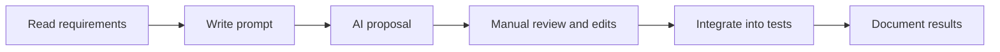

# AI-Assisted Software Testing Report

## Project context
- Technology stack: .NET 10, C# 14, NUnit, coverlet, Stryker.NET
- AI tool used: GitHub Copilot (GPT-5.3-Codex)

---

## 1) Report objective
This report documents how AI was used to support test design for the Shipping Quote API and compares AI proposals with the final, reviewed test suite.

The report covers:
- the role of AI in test design
- prompts and output analysis
- integration decisions and manual review criteria
- differences between AI proposals and final tests

---

## 2) Working approach

Two parallel design streams were used.

### A) Self-authored tests
The self-authored suite was designed from business rules and course testing strategies:
- equivalence partitioning and boundary values
- statement, decision, and condition coverage
- independent paths
- mutation-oriented reinforcement tests

### B) AI-assisted proposals
GitHub Copilot was used to generate candidate tests and ideas for:
- missing validation paths
- branch completion
- additional assertions
- mutation survivor targeting

AI output was treated as draft material and reviewed manually before integration.

---

## 3) AI-assisted workflow


---

## 4) Prompt catalog and intent
The prompts below are reconstructed examples created for documentation. The exact prompts used during drafting were not stored. These examples are explicit and targeted, but they are not claimed to be the original prompts.

| Prompt (reconstructed) | Intent | Output type | Usage note |
|---|---|---|---|
| Generate NUnit tests for a shipping cost service in C#. Use AAA comments, be deterministic, and cover both Brackets and BasePlusPerKg paths. Include explicit expected values and keep tests isolated. | Baseline coverage | Test cases with AAA | Candidate prompt |
| Create NUnit tests for rounding rules: None, Ceil1Kg, Ceil0_5Kg. Show expected totals for a single-parcel request and explain in comments why the rounded weight changes the fee. | Rounding branches | Unit tests for rounding | Candidate prompt |
| Generate boundary value tests using [TestCase] for bracket thresholds (1, 5, 10 kg) and for free shipping threshold equality. Use strict greater-than behavior. | Boundary behavior | Black-box tests | Candidate prompt |
| Write NUnit tests for invalid requests. Each test must assert the exact ArgumentException message. Focus on empty parcels, negative weight, negative subtotal, missing pricing model, missing rounding rule, missing parcel size. | Validation errors | Negative tests | Candidate prompt |
| Suggest tests that cover size fee branches across zones in BasePlusPerKg. Use two requests in one test and compare size fees for Large parcels. | Size-fee coverage | Branch tests | Candidate prompt |
| Provide tests for ShippingController: OK on success, BadRequest on ArgumentException. Use a stub service and assert the response payload type. | Controller behavior | Unit tests | Candidate prompt |
| Create a randomized fuzzing test that generates valid inputs with a fixed Random seed. Verify invariants: non-negative shipping, currency RON, SubtotalAfterDiscounts equals ShippingCost. | Robustness | Randomized test | Candidate prompt |
| Given survived mutants in ShippingCalculatorService related to RuleApplied tokens, propose two tests that would kill them. Include precise assertions on COUPON_DISCOUNT and MAX_CAP. | Mutation survivors | Rule trace assertions | Candidate prompt |

---

## 4.1) Context and references used in prompts
To make AI output specific, each prompt included short context that referenced the current code and desired behavior.

Common references included:
- Target class and method: ShippingCalculatorService.Calculate
- DTOs: ShippingQuoteRequest, ShippingQuoteResponse, ShippingBreakdown
- Rules: bracket thresholds, rounding rules, discounts, caps, and RuleApplied tokens
- Existing tests used as structure examples: ShippingCalculatorServiceTests and StrategyBlackBoxTests
- Intended test category: black-box, white-box, or mutation reinforcement

Files used as context sources:
- ProiectTSS/Services/ShippingCalculatorService.cs
- ProiectTSS/Dtos/ShippingQuoteRequest.cs
- ProiectTSS/Dtos/ShippingQuoteResponse.cs
- ProiectTSS.UnitTests/ShippingCalculatorServiceTests.cs
- ProiectTSS.UnitTests/Strategy_BlackBoxTests.cs
- ProiectTSS.UnitTests/Strategy_WhiteBoxPathTests.cs
- ProiectTSS.UnitTests/Strategy_RandomizedFuzzingTests.cs
- ProiectTSS.UnitTests/ShippingControllerTests.cs

## 5) Prompt and generated code examples (expanded)
This section shows reconstructed prompts and representative draft outputs. Drafts are intentionally different from the final integrated tests, while still being correct and runnable.

### Example 1: Baseline brackets and base-plus-per-kg coverage
Prompt:
> Generate NUnit tests for a shipping cost service in C#. Include AAA pattern, branch coverage for brackets and base-plus-per-kg models, coupon logic, free-shipping threshold, and input validation exceptions.

Reconstructed context provided to AI:
- Target: ShippingCalculatorService.Calculate
- Rules: Brackets vs BasePlusPerKg model selection
- DTOs: ShippingQuoteRequest with Parcels, Zone, PricingModel
- Structure hint: follow AAA style as in existing NUnit tests

AI output (draft, not final):
```csharp
[Test]
public void Calculate_WhenBracketsLocalUnderOneKg_ReturnsExpectedCost()
{
	// Arrange
	var request = CreateValidRequest();
	request.Zone = ShippingZone.Local;
	request.PricingModel = PricingModel.Brackets;
	request.Parcels = [new ParcelInput { WeightKg = 0.8m, Size = ParcelSize.Small }];

	// Act
	var result = _service.Calculate(request);

	// Assert
	Assert.That(result.ShippingCost, Is.EqualTo(8m));
	Assert.That(result.RuleApplied, Is.EqualTo("BRACKETS"));
}

[Test]
public void Calculate_WhenBasePlusPerKgModel_IsUsed_ReturnsExpectedCost()
{
	// Arrange
	var request = CreateValidRequest();
	request.Zone = ShippingZone.Local;
	request.PricingModel = PricingModel.BasePlusPerKg;
	request.Parcels = [new ParcelInput { WeightKg = 4m, Size = ParcelSize.Medium }];

	// Act
	var result = _service.Calculate(request);

	// Assert
	Assert.That(result.ShippingCost, Is.EqualTo(20m));
	Assert.That(result.RuleApplied, Is.EqualTo("BASE_PLUS_PER_KG"));
}
```

Review notes:
- Draft naming and helpers would be aligned to match repository conventions.

### Example 2: Rounding rules
Prompt:
> Create NUnit tests for rounding rules: None, Ceil1Kg, Ceil0_5Kg. Verify expected shipping totals for sample weights.

Reconstructed context provided to AI:
- Target: ApplyRounding via Calculate
- Rounding rules: None, Ceil1Kg, Ceil0_5Kg
- Model: BasePlusPerKg (so rounding affects per-kg fee)
- Structure hint: mirror existing ShippingCalculatorServiceTests style

AI output (draft, not final):
```csharp
[Test]
public void Calculate_WhenRoundingCeil1Kg_UsesRoundedWeight()
{
	var request = CreateValidRequest();
	request.Zone = ShippingZone.Local;
	request.PricingModel = PricingModel.BasePlusPerKg;
	request.RoundingRule = RoundingRule.Ceil1Kg;
	request.Parcels = [new ParcelInput { WeightKg = 1.2m, Size = ParcelSize.Small }];

	var result = _service.Calculate(request);

	Assert.That(result.ShippingCost, Is.EqualTo(14m));
	Assert.That(result.RuleApplied, Does.Contain("BASE_PLUS_PER_KG"));
}

[Test]
public void Calculate_WhenRoundingCeilHalfKg_UsesRoundedWeight()
{
	var request = CreateValidRequest();
	request.Zone = ShippingZone.Local;
	request.PricingModel = PricingModel.BasePlusPerKg;
	request.RoundingRule = RoundingRule.Ceil0_5Kg;
	request.Parcels = [new ParcelInput { WeightKg = 1.2m, Size = ParcelSize.Small }];

	var result = _service.Calculate(request);

	Assert.That(result.ShippingCost, Is.EqualTo(13m));
	Assert.That(result.RuleApplied, Does.Contain("BASE_PLUS_PER_KG"));
}
```

Review notes:
- Would align names and add AAA comments for consistency.

### Example 3: Boundary value analysis
Prompt:
> Generate boundary value tests for bracket thresholds (1, 5, 10 kg) and for free shipping threshold equality.

Reconstructed context provided to AI:
- Target: GetBracketFee thresholds and free shipping condition
- Bracket thresholds for Local zone: 1, 5, 10
- Free shipping is strict greater-than on Subtotal
- Structure hint: use [TestCase] for BVA

AI output (draft, not final):
```csharp
[TestCase(1.0, 8)]
[TestCase(1.01, 15)]
[TestCase(5.0, 15)]
[TestCase(5.01, 25)]
[TestCase(10.0, 25)]
[TestCase(10.01, 25.03)]
public void Calculate_WhenWeightAtBoundary_ReturnsExpectedBracketTransition(decimal weightKg, decimal expectedCost)
{
	var request = CreateValidRequest();
	request.Zone = ShippingZone.Local;
	request.PricingModel = PricingModel.Brackets;
	request.Parcels = [new ParcelInput { WeightKg = weightKg, Size = ParcelSize.Small }];

	var result = _service.Calculate(request);

	Assert.That(result.ShippingCost, Is.EqualTo(expectedCost));
	Assert.That(result.RuleApplied, Does.Contain("BRACKETS"));
}

[Test]
public void Calculate_WhenSubtotalEqualsFreeShippingThreshold_DoesNotApplyFreeShipping()
{
	var request = CreateValidRequest();
	request.Subtotal = 200m;
	request.FreeShippingThreshold = 200m;

	var result = _service.Calculate(request);

	Assert.That(result.ShippingCost, Is.GreaterThan(0m));
	Assert.That(result.Breakdown.FreeShippingDiscount, Is.EqualTo(0m));
}
```

Review notes:
- Would add category attributes and align method names to the suite.

### Example 4: Validation exceptions
Prompt:
> Write NUnit tests to validate exceptions for invalid requests (empty parcels, negative weight, negative subtotal, missing pricing model, missing rounding rule, missing parcel size).

Reconstructed context provided to AI:
- Target: ValidateRequest in ShippingCalculatorService
- Expected exception type: ArgumentException
- Expected messages taken from validation in code
- Structure hint: one assertion per validation branch

AI output (draft, not final):
```csharp
[Test]
public void Calculate_WhenParcelsAreEmpty_ThrowsArgumentException()
{
	var request = CreateValidRequest();
	request.Parcels = [];

	var act = () => _service.Calculate(request);

	Assert.That(act, Throws.TypeOf<ArgumentException>()
		.With.Message.EqualTo("parcels must contain at least one item."));
}

[Test]
public void Calculate_WhenRoundingRuleIsNull_ThrowsArgumentException()
{
	var request = CreateValidRequest();
	request.RoundingRule = null;

	var act = () => _service.Calculate(request);

	Assert.That(act, Throws.TypeOf<ArgumentException>()
		.With.Message.EqualTo("roundingRule must be explicitly set."));
}
```

Review notes:
- Drafts would be extended to cover all listed validation branches.

### Example 5: Size fee branches
Prompt:
> Suggest tests for size fee branches across zones (Small, Medium, Large) in BasePlusPerKg model.

Reconstructed context provided to AI:
- Target: GetSizeFee by zone and size
- Zones: Local, National, International
- Sizes: Small, Medium, Large
- Structure hint: compare two requests in the same test

AI output (draft, not final):
```csharp
[Test]
public void Calculate_WhenLargeParcelsAcrossZones_UsesZoneSpecificLargeSizeFees()
{
	var nationalRequest = CreateValidRequest();
	nationalRequest.Zone = ShippingZone.National;
	nationalRequest.PricingModel = PricingModel.BasePlusPerKg;
	nationalRequest.Parcels = [new ParcelInput { WeightKg = 1m, Size = ParcelSize.Large }];

	var internationalRequest = CreateValidRequest();
	internationalRequest.Zone = ShippingZone.International;
	internationalRequest.PricingModel = PricingModel.BasePlusPerKg;
	internationalRequest.Parcels = [new ParcelInput { WeightKg = 1m, Size = ParcelSize.Large }];

	var localRequest = CreateValidRequest();
	localRequest.Zone = ShippingZone.Local;
	localRequest.PricingModel = PricingModel.BasePlusPerKg;
	localRequest.Parcels = [new ParcelInput { WeightKg = 1m, Size = ParcelSize.Large }];

	var nationalResult = _service.Calculate(nationalRequest);
	var internationalResult = _service.Calculate(internationalRequest);
	var localResult = _service.Calculate(localRequest);

	Assert.That(nationalResult.Breakdown.SizeFee, Is.EqualTo(8m));
	Assert.That(internationalResult.Breakdown.SizeFee, Is.EqualTo(15m));
	Assert.That(localResult.Breakdown.SizeFee, Is.EqualTo(5m));
}
```

Review notes:
- Would be paired with a Local zone case in the final suite.

### Example 6: Controller behavior
Prompt:
> Provide tests for ShippingController: OK on success, BadRequest on ArgumentException. Use a stub service.

Reconstructed context provided to AI:
- Target: ShippingController.Quote action
- Expected outcomes: OkObjectResult and BadRequestObjectResult
- Structure hint: use a stub service and minimal request

AI output (draft, not final):
```csharp
[Test]
public void Quote_WhenServiceSucceeds_ReturnsOkObjectResult()
{
	var expected = new ShippingQuoteResponse
	{
		ShippingCost = 10m,
		Currency = "RON",
		Breakdown = new ShippingBreakdown { SubtotalAfterDiscounts = 10m },
		RuleApplied = "BRACKETS"
	};

	var controller = new ShippingController(new StubShippingCalculatorService(expected));
	var request = CreateValidRequest();

	var result = controller.Quote(request);

	Assert.That(result.Result, Is.TypeOf<OkObjectResult>());
	Assert.That(((OkObjectResult)result.Result!).Value, Is.Not.Null);
}
```

Review notes:
- Would add payload assertion and a BadRequest case in the final suite.

### Example 7: Randomized fuzzing test
Prompt:
> Create a randomized fuzzing test that generates valid inputs and verifies invariants (non-negative shipping, RON currency, SubtotalAfterDiscounts == ShippingCost).

Reconstructed context provided to AI:
- Target: Calculate invariants in ShippingQuoteResponse
- Invariants: ShippingCost >= 0, Currency == RON, SubtotalAfterDiscounts == ShippingCost
- Structure hint: deterministic Random seed

AI output (draft, not final):
```csharp
[Test]
public void Calculate_WhenRandomValidInputsAreGenerated_PreservesBasicInvariants()
{
	var random = new Random(2026);

	for (var i = 0; i < 100; i++)
	{
		var request = CreateRandomValidRequest(random);
		var result = _service.Calculate(request);

		Assert.Multiple(() =>
		{
			Assert.That(result.ShippingCost, Is.GreaterThanOrEqualTo(0m));
			Assert.That(result.Currency, Is.EqualTo("RON"));
			Assert.That(result.Breakdown.SubtotalAfterDiscounts, Is.EqualTo(result.ShippingCost));
			Assert.That(result.Breakdown.SubtotalBeforeDiscounts, Is.GreaterThanOrEqualTo(0m));
		});
	}
}
```

Review notes:
- Would ensure the helper that generates random requests stays within validation constraints.

### Example 8: Rule traceability for coupon application
Reconstructed suggestion: add explicit assertions on RuleApplied when coupon logic is used.

Reconstructed context provided to AI:
- Target: RuleApplied output tokens
- Coupon should add COUPON_DISCOUNT when free shipping is not applied
- Structure hint: use a minimal request with coupon and brackets

Integrated test (final version in repository):
```csharp
[Test]
public void Calculate_WhenCouponIsApplied_RuleAppliedContainsCouponDiscountToken()
{
	// Arrange
	var request = CreateValidRequest();

	request.Zone = ShippingZone.Local;
	request.PricingModel = PricingModel.Brackets;
	request.Coupon = new CouponInput { Type = CouponType.Fixed, Value = 1m };

	// Act
	var result = _service.Calculate(request);

	// Assert
	Assert.That(result.RuleApplied, Does.Contain("COUPON_DISCOUNT"));
}
```

Why this matters:
- Without this assertion, a mutant that removes the token would survive.
- The rule trace is part of the API contract, not a debug detail.

### Example 9: Rule traceability for cap application
Reconstructed suggestion: assert that MAX_CAP is reported when cap is applied.

Reconstructed context provided to AI:
- Target: RuleApplied output tokens for cap logic
- Cap should apply when net > MaxCap
- Structure hint: use International + large parcel to exceed cap

Integrated test (final version in repository):
```csharp
[Test]
public void Calculate_WhenCapIsApplied_RuleAppliedContainsMaxCapToken()
{
	// Arrange
	var request = CreateValidRequest();
	request.Zone = ShippingZone.International;
	request.PricingModel = PricingModel.Brackets;
	request.Options = new ShippingOptions { Fragil = true, Rapid = true };
	request.Parcels = [new ParcelInput { WeightKg = 8.5m, Size = ParcelSize.Large }];
	request.MaxCap = 60m;

	// Act
	var result = _service.Calculate(request);

	// Assert
	Assert.That(result.RuleApplied, Does.Contain("MAX_CAP"));
}
```

### Example 10: Mutation survivors targeting
Prompt:
> Given survived mutants in ShippingCalculatorService, suggest two non-equivalent test cases that are likely to kill them, and include precise assertions.

Reconstructed context provided to AI:
- Target: Survived mutants in RuleApplied token additions
- Mutants: removal of rules.Add(RuleCouponDiscount) and rules.Add(RuleMaxCap)
- Goal: add assertions that fail if tokens are missing

AI output (draft, not final):
```csharp
[Test]
public void Calculate_WhenCouponApplied_AddsCouponToken()
{
	var request = CreateValidRequest();
	request.Zone = ShippingZone.Local;
	request.PricingModel = PricingModel.Brackets;
	request.Coupon = new CouponInput { Type = CouponType.Fixed, Value = 1m };

	var result = _service.Calculate(request);
	var applied = result.RuleApplied;

	Assert.That(applied, Does.Contain("COUPON_DISCOUNT"));
}

[Test]
public void Calculate_WhenCapApplied_AddsMaxCapToken()
{
	var request = CreateValidRequest();
	request.Zone = ShippingZone.International;
	request.PricingModel = PricingModel.Brackets;
	request.Options = new ShippingOptions { Fragil = true, Rapid = true };
	request.Parcels = [new ParcelInput { WeightKg = 8.5m, Size = ParcelSize.Large }];
	request.MaxCap = 60m;

	var result = _service.Calculate(request);
	var applied = result.RuleApplied;

	Assert.That(applied, Does.Contain("MAX_CAP"));
}
```

Review notes:
- Drafts focus on RuleApplied assertions and would be aligned to existing naming.

---

## 6) Review criteria used for AI proposals
AI output was reviewed against a strict checklist before integration:
- Does the test target a concrete business rule?
- Does it include precise assertions (not just non-null checks)?
- Does it cover boundary behavior, not just normal cases?
- Does it duplicate existing tests without adding value?
- Does it match the required testing strategy from the course?

---

## 7) Comparative analysis: team suite vs AI proposals
| Criterion | Self-authored suite | AI proposals | Interpretation |
|---|---|---|---|
| Alignment with course requirements | Very strong | Good but generic in places | Manual suite mirrors rubric more precisely |
| Business rule precision | High | Medium | AI misses domain intent in some cases |
| Test naming quality | Domain-specific | Sometimes generic | Manual naming is clearer for maintenance |
| Rare branch coverage | Strong after refinement | Variable | AI helps discovery, manual review finalizes |
| Assertion quality | Strong, traceability included | Good baseline | Human review still required |
| Mutation effectiveness | Strong after targeted additions | Helpful suggestions | Context-aware selection remains manual |

---

## 8) Risks and mitigations
Observed risks:
- syntactically correct but semantically weak tests
- missing edge coverage
- false confidence due to test volume
- limited ability to classify equivalent mutants

Mitigations applied:
- manual review of all AI outputs
- mutation testing feedback loop
- explicit RuleApplied assertions for traceability

---

## 9) Conclusion
GitHub Copilot was useful as an accelerator for test drafting, but the final test quality depended on manual review, domain understanding, and mutation-driven refinement.

Explicit credit: this project was assisted by GitHub Copilot (GPT-5.3-Codex).