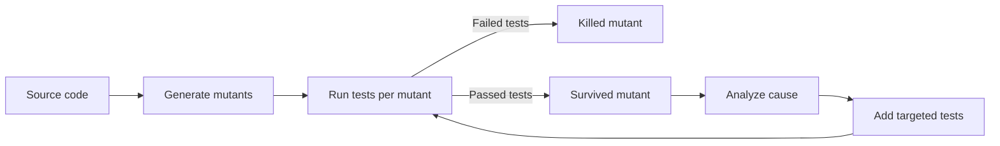
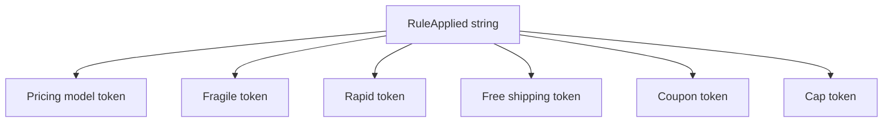

# Mutation Testing Analysis (Stryker.NET)

This document provides a focused mutation testing analysis for the ShippingCalculatorService. It explains how mutation testing was applied, how the report was interpreted, and how two non-equivalent survivors were killed by targeted tests.

---

## 1) Tool and scope
- Tool: Stryker.NET for C# mutation testing
- Target: ShippingCalculatorService and its calculation rules
- Goal: Validate that test assertions are strong enough to detect incorrect behavior, not just execute code paths

---

## 2) How to run
From repository root:

```bash
dotnet tool install -g dotnet-stryker
cd ProiectTSS.UnitTests
dotnet stryker
```

---

## 3) Mutation testing pipeline
Mutation testing works by injecting small code changes (mutants) and re-running tests. If tests fail, the mutant is killed. If tests pass, the mutant survives and indicates weak assertions or missing checks.



---

## 4) Typical report interpretation
The Stryker report groups mutants into outcomes that show test strength.

| Status | Meaning | Implication |
|---|---|---|
| Killed | Tests detected behavior change | Assertions are strong for that code change |
| Survived | Tests did not detect change | Possible missing assertions or edge cases |
| Equivalent | Change is behavior-preserving | Cannot be killed without changing requirements |

---

## 5) Mutant types relevant to this project
Stryker generated several mutant types that are meaningful for shipping calculations:

| Mutant type | Example effect | Risk if survived |
|---|---|---|
| Statement removal | Removes rule token insertion | Traceability becomes incorrect |
| Relational change | >= instead of > on threshold | Boundary behavior becomes wrong |
| Arithmetic change | Different multiplier | Incorrect shipping cost |
| Conditional change | Flips branch | Rule path becomes inconsistent |

---

## 6) Analysis of survived mutants and targeted fixes
The report identified two non-equivalent survivors. Both were related to rule traceability (RuleApplied), which is a functional requirement for auditing and debugging. Numeric output was not enough to detect these mutations, so targeted assertions were added.

### 6.1 Mutant A
- Report location: StrykerOutput/2026-04-20.00-44-47/reports/mutation-report.html
- Mutant id: 52
- File: ShippingCalculatorService.cs
- Mutation: statement removal on rules.Add(RuleCouponDiscount)

**Why non-equivalent:**
Removing the rule token does not change the shipping cost, but it changes the observable behavior in RuleApplied. This is not equivalent because the response is required to include rule traceability tokens.

**Killer test added:**
Calculate_WhenCouponIsApplied_RuleAppliedContainsCouponDiscountToken

**Effect of the killer test:**
The test explicitly checks that COUPON_DISCOUNT is present, so a mutation that removes the token fails the assertion.

### 6.2 Mutant B
- Report location: StrykerOutput/2026-04-20.00-44-47/reports/mutation-report.html
- Mutant id: 67
- File: ShippingCalculatorService.cs
- Mutation: statement removal on rules.Add(RuleMaxCap)

**Why non-equivalent:**
Removing the rule token hides the fact that the cap was applied. The numeric output remains capped, but the traceability signal is lost, which is a behavioral change.

**Killer test added:**
Calculate_WhenCapIsApplied_RuleAppliedContainsMaxCapToken

**Effect of the killer test:**
The test verifies that MAX_CAP appears in RuleApplied, which kills the mutant.

---

## 7) Traceability of rule tokens (why these mutants matter)
RuleApplied is part of the public response contract. It records the pricing and modifier rules that were applied. This is critical for:
- explaining how the price was computed
- debugging issues when customer complaints occur
- verifying that promotional rules are actually used



## 8) Limitations and notes
- Mutation testing is more expensive than regular tests, so it is used as a focused quality gate.
- Equivalent mutants are expected and are documented as such; they do not indicate weak tests.
- The report file is the authoritative source for exact mutant counts.
